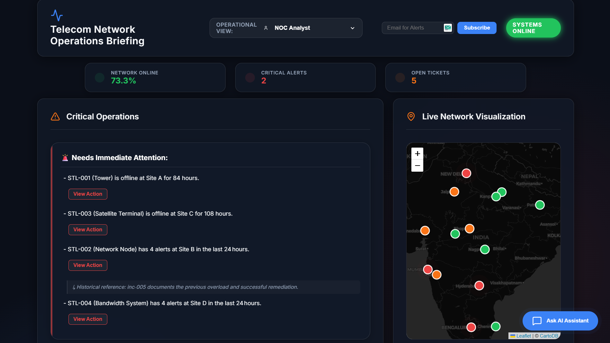
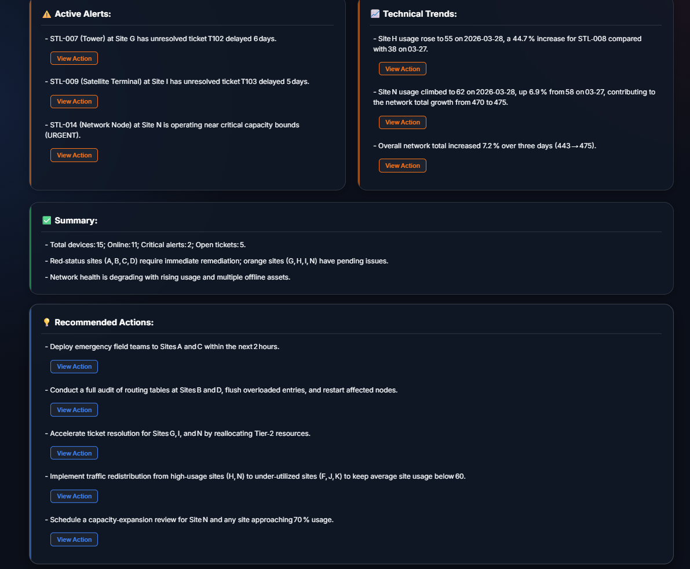
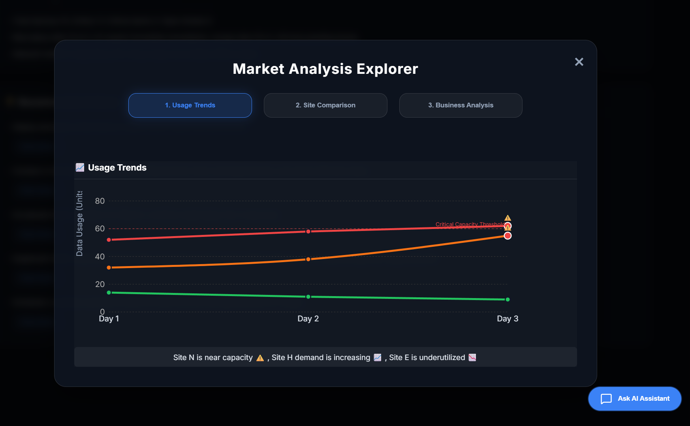
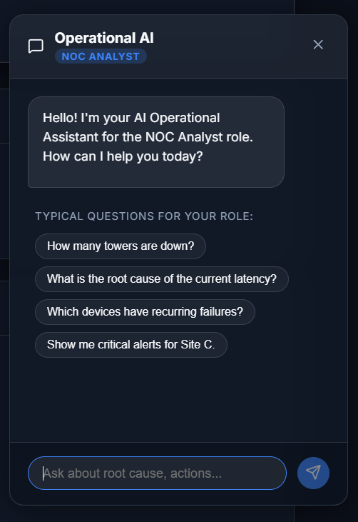

# 🚀 Syntomos — AI Telecom Network Operations Dashboard

An AI-powered decision intelligence platform that transforms fragmented telecom operational data into concise, role-based daily briefings, predictive alerts, and interactive AI assistance.

Syntomos acts as an intelligence layer on top of existing monitoring tools, helping telecom operations teams understand **what happened, why it matters, and what to do next**.


---

## 📸 Screenshots

<div align="center">
  
  
  <br />
  
  
</div>

---

## 🧠 Overview

Modern telecom operations teams are overwhelmed by fragmented dashboards, alert fatigue, and disconnected ticketing systems.

**Syntomos** acts as an intelligence layer on top of existing monitoring tools by consolidating:

* 📡 Device health
* 🚨 Alert streams
* 📊 Usage metrics
* 🎫 Support tickets
* 📍 Site-level performance
* 📚 Operational Knowledge Base (SOPs & History)

The system uses AI to prioritize incidents based on operational and business impact and delivers **role-specific briefings** for different stakeholders.

---

## ✨ Key Features

### 🧠 RAG-Powered Role-Based Daily Briefing
Customized summaries and actionable insights for:
* 👨‍🔧 Fleet Operations Manager
* 🧑‍💻 NOC Analyst
* 🦺 Site Supervisor

Uses **Retrieval-Augmented Generation (RAG)** to correlate live data with historical incidents and Standard Operating Procedures (SOPs).

### 🤖 Interactive AI Chatbot
A domain-specific assistant powered by **openai/gpt-oss-120b** (via Groq) providing:
* Root cause analysis
* Context-aware SOP recommendations
* Multi-role support

### 🚨 Critical Alert Notifications
* **Real-time Subscriptions**: Subscribe via the dashboard for instant email alerts.
* **Proactive Notifications**: Critical failures trigger immediate alerts via SendGrid/Mailgun.

### 📊 Market Analysis Explorer
* **Usage Trends**: Deep dive into network-wide bandwidth consumption.
* **Site Comparison**: Performance benchmarking across geographic sites.
* **Business Analytics**: Strategic cost vs. profit analysis per site.

### 📍 Interactive Network Map
* Pulsing outage markers with geographic precision.
* Hover-over health status and incident reasons.

---

## 🛠️ Tech Stack

### Frontend
* **React (Vite)**
* **Leaflet** (GIS mapping)
* **Recharts** (Interactive analytics)
* **Lucide React** (Iconography)

### Backend
* **Python (Flask)**
* **Pandas** (Data processing)
* **FAISS** (Vector database for RAG)
* **Sentence-Transformers** (Semantic embeddings)
* **Groq SDK** (LLM Orchestration)

---

## 🏗️ System Architecture

```text
Data Sources (CSV)  ───►  Detection Engine  ───►  Query Builder
                              (Pandas)              (RAG Logic)
                                                        │
Briefing/Chat UI    ◄───  AI Intelligence   ◄───  FAISS Vector DB
 (React Frontend)         (GPT-OSS-120b)          (SOPs/History)
                                │
                        Subscription Engine ───►  Email Alerts
                                                  (SendGrid)
```

---

## 🚀 Getting Started

### 1️⃣ Setup Backend

```bash
cd backend
# Recommended: create a virtual environment first
pip install -r requirements.txt
cp .env.template .env
# Add API keys to .env
python app.py
```

### 2️⃣ Setup Frontend

```bash
cd frontend
npm install
npm run dev
```

---

## 🔑 Environment Variables

Create a `.env` file in the `backend` directory:

```env
OPENAI_API_KEY=your_openai_key
GROQ_API_KEY=your_groq_key
SENDGRID_API_KEY=your_sendgrid_key
SENDER_EMAIL=alerts@telecom-ops.ai
DISABLE_SENDGRID=false # Set to true to bypass email sending
```

---

## 📌 Usage

* **Role Switching**: Use the top-right selector to view role-specific intelligence.
* **SOP Access**: Click "View Action" in briefings to reveal RAG-retrieved procedures.
* **Alerts**: Enter your email in the header to subscribe to critical network events.
* **Analytics**: Open the "Market Analysis" explorer for strategic network insights.

---

## 👨‍💻 Team

Built by **Code Warriors**
